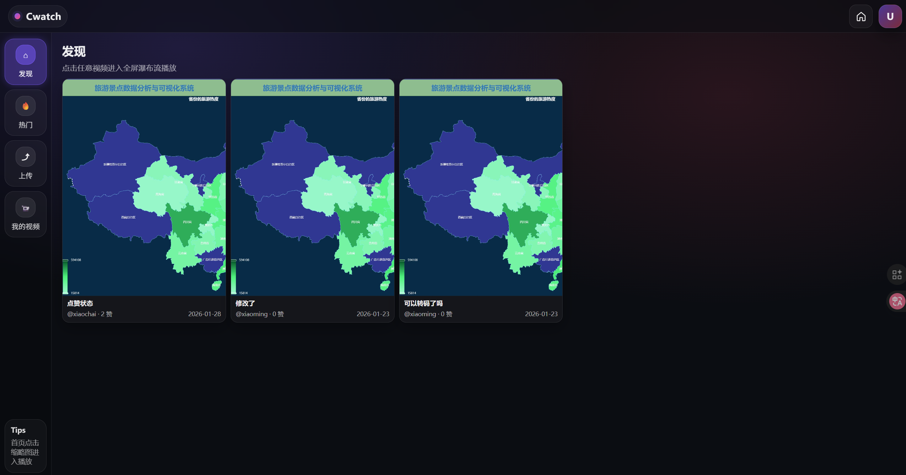

# 畅看项目 (Cwatch)

**注**：本项目用于自己学习和实践 Go + Gin 框架以及相关中间件技术。

> 一个基于 Go + Gin 的短视频分享平台

## 📖 项目简介

本项目是一个全栈短视频分享平台，支持视频上传、播放、点赞、评论、热门视频排行等核心功能。采用微服务架构，使用消息队列和缓存技术解决高并发场景下的性能问题。

## ✨ 核心功能

### 用户功能
- ✅ 用户注册/登录（JWT认证）
- ✅ 用户信息管理
- ✅ 个人视频管理

### 视频功能
- ✅ 视频上传（支持多种格式：mp4/webm/mov/avi/mkv）
- ✅ 视频播放（支持多清晰度：原画/1080p/720p）
- ✅ 视频列表浏览（分页加载）
- ✅ 热门视频排行（按点赞数排序）
- ✅ 自动生成视频封面

### 互动功能
- ✅ 点赞/取消点赞（支持高并发）
- ✅ 评论/删除评论
- ✅ 视频分享
- ✅ 实时点赞数统计

### 播放器功能
- ✅ 视频进度条拖动
- ✅ 播放/暂停控制
- ✅ 音量控制（全局静音）
- ✅ 清晰度切换
- ✅ 双击点赞动画

### 首页展示


## 🛠️ 技术栈

### 后端技术
- **Go 1.24.9** - 主要开发语言
- **Gin** - Web框架，构建RESTful API
- **GORM** - ORM框架，数据库操作
- **MySQL 8.0** - 关系型数据库，存储用户、视频、评论、点赞数据
- **Redis 8.0** - 缓存中间件，存储热点数据（点赞数、热门视频排行）
- **RabbitMQ 3.11** - 消息队列，异步处理点赞、视频处理任务
- **MinIO** - 对象存储服务，存储视频文件和封面图
- **JWT** - 用户认证和授权
- **Bcrypt** - 密码加密
- **FFmpeg 8.0.1** - 视频处理（生成封面、转码多清晰度）

### 前端技术
- **原生 JavaScript (Vanilla JS)** - 无框架开发
- **HTML5 + CSS3** - 页面结构和样式
- **HTML5 Video API** - 视频播放控制
- **Fetch API** - 前后端数据交互

### 基础设施
- **Docker + Docker Compose** - 容器化部署
- **Nginx 1.28** - 反向代理和静态资源服务

## 🏗️ 架构设计

### 系统架构
```
┌─────────────┐      ┌─────────────┐      ┌─────────────┐
│   前端页面   │ ───> │  Backend API │ ───> │   MySQL     │
│  (Web/JS)   │      │   (Gin)     │      │  (数据库)    │
└─────────────┘      └─────────────┘      └─────────────┘
                            │                      │
                            ├──────────────────────┤
                            │                      │
                     ┌──────▼──────┐        ┌─────▼──────┐
                     │   Redis     │        │  RabbitMQ  │
                     │  (缓存)     │        │ (消息队列)  │
                     └─────────────┘        └─────┬──────┘
                                                   │
                     ┌─────────────┐        ┌─────▼──────┐
                     │   MinIO     │ <───── │   Worker   │
                     │ (对象存储)   │        │  (消费者)   │
                     └─────────────┘        └────────────┘
```

### 分层架构
- **Controller层** - 处理HTTP请求，参数验证
- **Service层** - 业务逻辑处理
- **Model层** - 数据模型定义
- **Utils层** - 工具函数（数据库、缓存、存储、消息队列）

## 🎯 技术亮点

### 1. 高并发点赞优化
**问题**：大量用户同时点赞会导致数据库压力过大

**解决方案**：
- Redis缓存点赞数，快速响应用户请求（毫秒级）
- RabbitMQ异步队列，批量更新MySQL
- 使用原子操作（INCR/DECR）防止并发冲突
- 最终一致性模型，保证数据准确性

### 2. 视频存储与分发
**问题**：大文件存储和高并发访问

**解决方案**：
- MinIO对象存储，支持分布式扩展
- 预签名URL，安全上传下载
- 多清晰度转码（720p/1080p），适配不同网络环境
- CDN加速（可扩展）

### 3. 异步视频处理
**问题**：视频上传后需要生成封面、转码，耗时长

**解决方案**：
- RabbitMQ异步任务队列
- Worker独立服务处理视频任务
- 用户上传后立即返回，后台异步处理
- FFmpeg高效视频处理

### 4. 数据一致性保证
**问题**：Redis缓存与MySQL数据不一致

**解决方案**：
- 最终一致性模型
- Worker定期同步Redis数据到MySQL
- 事务保证videos表和likes表操作原子性
- 失败重试机制

## 🔧 环境要求

- **Go 1.24.9** (Windows开发环境)
- **FFmpeg 8.0.1** (Windows开发环境)
- **Docker + Docker Compose** (服务器部署)
  - MySQL 8.0
  - Redis 8.0
  - RabbitMQ 3.11-management
  - Nginx 1.28
  - MinIO RELEASE.2025-09-07T16-13-09Z


## 📁 项目结构

```bash
/backend              # 后端服务
  /config            # 配置文件（数据库、Redis、MinIO等）
  /controllers       # 控制层（处理HTTP请求）
  /routes            # 路由定义
  /models            # 数据模型（User、Video、Comment、Like）
  /services          # 业务逻辑层
  /middlewares       # 中间件（JWT认证）
  /utils             # 工具函数（MySQL、Redis、MinIO、RabbitMQ）
  main.go            # 主程序入口

/web                 # 前端页面
  /js                # JavaScript文件
  /css               # 样式文件
  index.html         # 主页面

/worker              # 消费者服务（异步任务处理）
  /config            # 配置文件
  main.go            # 消费者主程序（处理视频封面生成、转码等）

/compose             # Docker Compose配置文件
  docker-compose.yml  # 配置文件

README.md            # 项目说明文档
```

## 🚀 快速开始

### 1. 环境准备

#### 服务器端（Docker部署）
```bash
# 使用 Docker Compose 部署基础服务
docker-compose up -d

# 包含以下服务：
# - MySQL 8.0
# - Redis 8.0
# - RabbitMQ 3.11-management
# - MinIO
# - Nginx 1.28
```

#### 开发环境（Windows）
- 安装 Go 1.24.9
- 安装 FFmpeg 8.0.1

### 2. 配置文件

修改 `backend/config/config.go` 和 `worker/config/config.go`，配置数据库、Redis、MinIO、RabbitMQ连接信息。

### 3. 启动服务

#### 启动后端API服务
```bash
cd backend
go run main.go
```

#### 启动Worker消费者服务
```bash
cd worker
go run main.go
```


## 📊 数据库设计

### 核心表结构

#### users 表（用户表）
- id, username, password, avatar_url, created_at, updated_at

#### videos 表（视频表）
- id, title, url, url_720p, url_1080p, cover_url, user_id, like_count, status, created_at, updated_at

#### likes 表（点赞表）
- id, user_id, video_id, created_at

#### comments 表（评论表）
- id, user_id, video_id, content, created_at, updated_at

## 🔐 API接口

### 用户相关
- `POST /api/register` - 用户注册
- `POST /api/login` - 用户登录
- `GET /api/user/:id` - 获取用户信息

### 视频相关
- `GET /api/videos` - 获取视频列表（支持分页）
- `POST /api/videos/hot` - 获取热门视频
- `GET /api/user/:id/videos` - 获取用户视频列表
- `POST /api/video/upload-url` - 获取上传凭证
- `POST /api/video/confirm-upload` - 确认上传完成
- `DELETE /api/video/delete` - 删除视频

### 互动相关
- `POST /api/video/toggle-like` - 切换点赞状态
- `GET /api/video/:id/comments` - 获取评论列表
- `POST /api/video/comment/:id` - 发表评论
- `DELETE /api/video/comment/:id` - 删除评论

---


